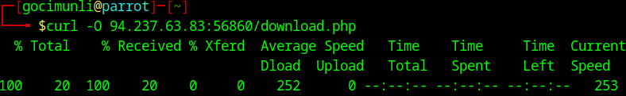
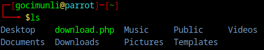
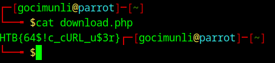

# Description

This document contains solutions for all questions from Web Requests module.

# HTTP Fundamentals
## HyperText Transfer Protocol (HTTP)

Our task here is to download /download.php file using cURL.

After starting our target machine we input the following command:

`curl -o <TARGET_IP>/download.php`

Replace `<TARGET_IP>` with the IP address of your target machine.

Next, we run `ls` command to list the contents of our current directory.

We can see that we have downloaded the file sucessfully.
Now we need just need to read the contents of our fle. We can do that using the `cat` command: 

