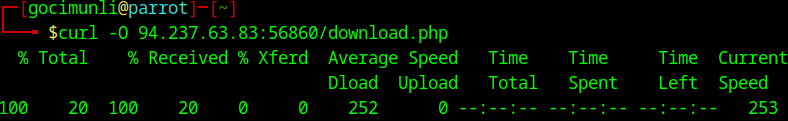
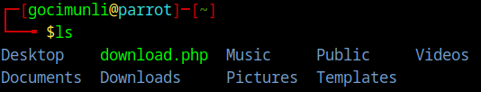
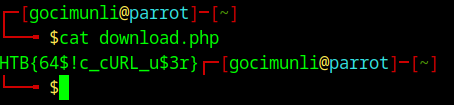
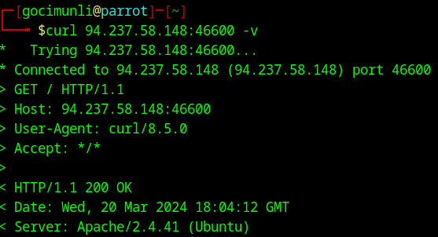

# Description

This document contains solutions for all questions from Web Requests module.

# HTTP Fundamentals
## HyperText Transfer Protocol (HTTP)

Our task here is to download /download.php file using cURL.

After starting our target machine we input the following command:

`curl -O <TARGET_IP>/download.php`

We use the `-O` option when we want to keep the remote file name.

Replace `<TARGET_IP>` with the IP address of your target machine.

Next, we run `ls` command to list the contents of our current directory.

We can see that we have downloaded the file sucessfully.
Now we just need to read the contents of our file. We can do that using the `cat` command: 

## HTTP Requests and Responses

We have two tasks here:
  1. Find out what is the HTTP method used while intercepting the request. (case-sensitive)
  2. Find out the version of Apache server running on our target.

We can find out all of the needed information by running one single command:

`curl <TARGET_IP> -v`

Replace `<TARGET_IP>` with the IP address of your target machine.

By using `-v`, verbose,  option we will get both request and response in our output.

Line `> GET / HTTP/1.1` is the soultion to our first question. HTTP method used is GET.
Line `< Server: Apache/2.4.41 (Ubuntu)` gives us the version of Apache server which is 2.4.41

