# Description

This document contains solutions for all questions from Web Requests module.

# HTTP Fundamentals
## HyperText Transfer Protocol (HTTP)

Our task here is to download /download.php file using cURL.

After starting our target machine we input the following command:

`curl -O <TARGET_IP>/download.php`

We use the `-O` option when we want to keep the remote file name.

Replace `<TARGET_IP>` with the IP address of your target machine.

Next, we run `ls` command to list the contents of our current directory.

We can see that we have downloaded the file sucessfully.
Now we just need to read the contents of our file. We can do that using the `cat` command: 

## HTTP Requests and Responses

We have two tasks here:
  1. Find out what is the HTTP method used while intercepting the request. (case-sensitive)
  2. Find out the version of Apache server running on our target.

We can find out all of the needed information by running one single command:

`curl <TARGET_IP> -v`

Replace `<TARGET_IP>` with the IP address of your target machine.

By using `-v`, verbose,  option we will get both request and response in our output.

Line `> GET / HTTP/1.1` is the soultion to our first question. HTTP method used is GET.
Line `< Server: Apache/2.4.41 (Ubuntu)` gives us the version of Apache server which is 2.4.41

## HTTP Headers

This time we are tasked to use browser dev tools instead of cURL.

  1. Search for the target, with its IP address, inside your browser of choice.
  2. Open brower dev tools [ctrl + shift + i].
  3. Open Network tab.
  4. Refresh [ctrl + r].
  5. Select file with name flag...
  6. Open response tab and copy the flag.

  

  # HTTP METHODS
  ## GET

For this task we need to log in our target with supplied user credentials via browser.
Credentials are 'admin' for the username and same for the password.

 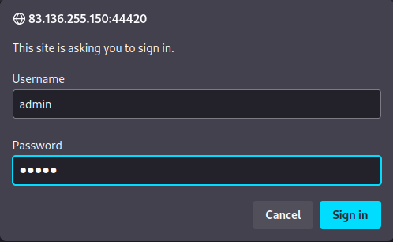

 After we gain access to the website, we need to search for any term using the search box provided.

 

 The output is not that interesting. Now we need to find out the method that was used for data retrieval. We can find that info in the Network tab of the dev tools.
 We go to our Network tab of dev tools and refresh using [ctrl + r]. Then we search again for any term.

 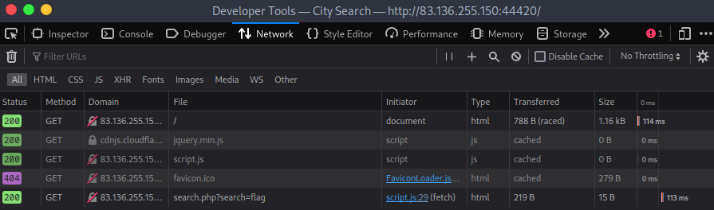

 Our call is at the bottom of the stack. We select it to find out the call that we need for the cURL call.

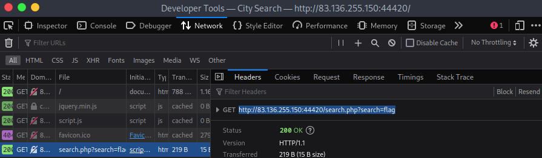

After finding out the call and method, we can get our flag by searching for that term with cURL.

## POST

This task is similar to previous one but uses a different method.
First we need to log in via the browser.

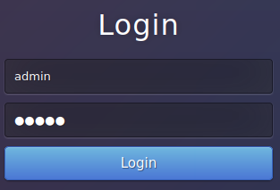

Now that we have access, we need to check our network tab of dev tools to see the request.

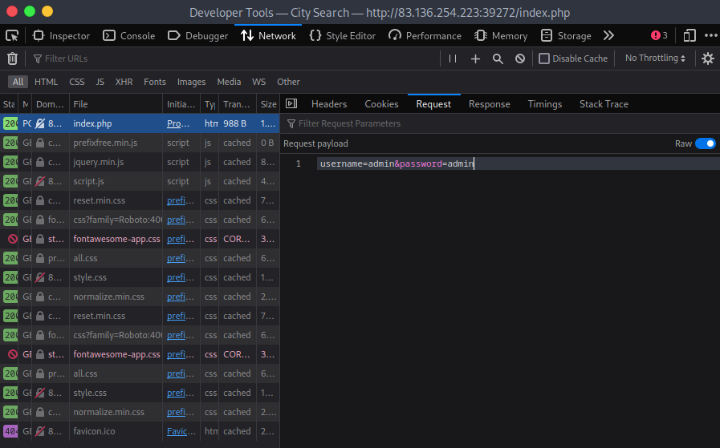

We can now replicate that request using cURL and POST method with the POST data.

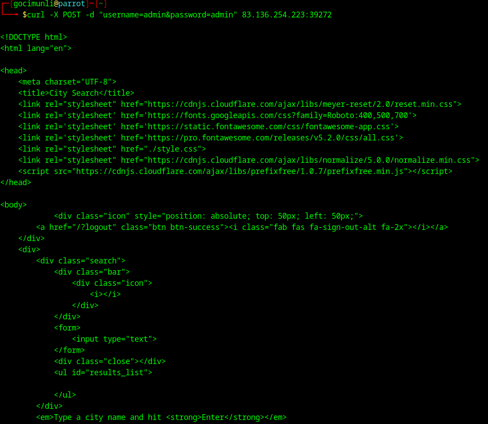

Next step is to inspect the request body to get neccessary cookie data.

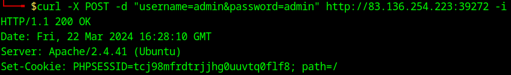

We can now make a request using the cookie data.

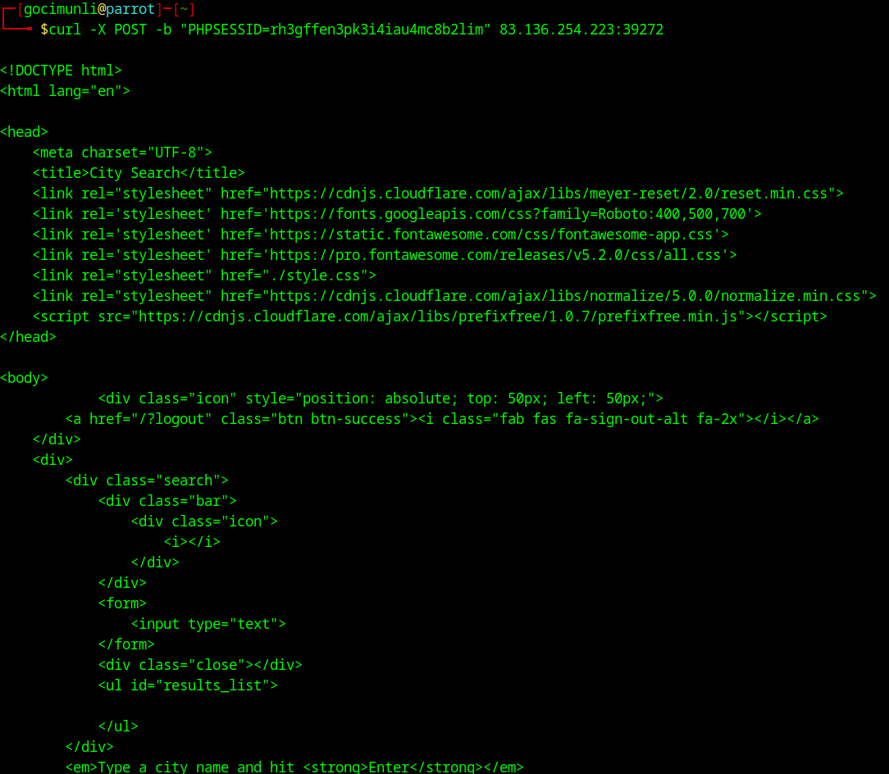

If we make a search using provided search box, we get no results.

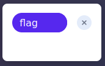

Now we inspect the request that was made for search action.

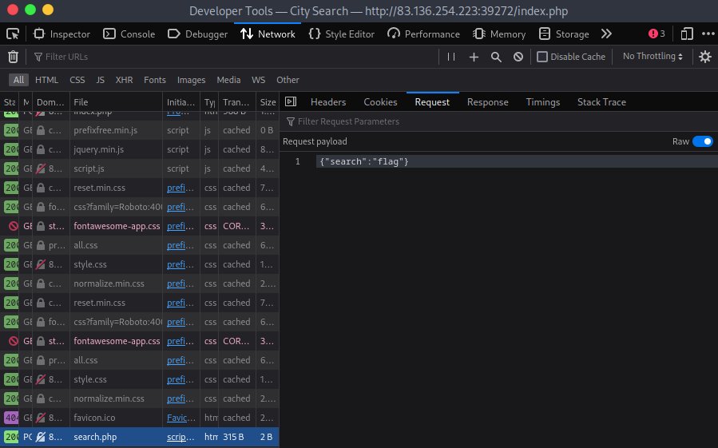

With the data of the request and request file we can now make full request with cURL to get the flag.

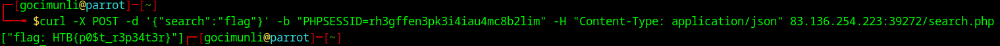
